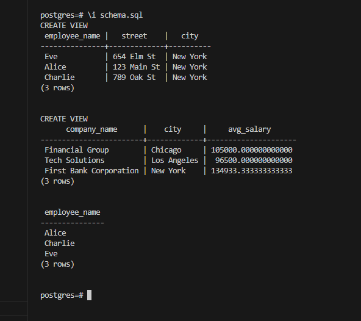
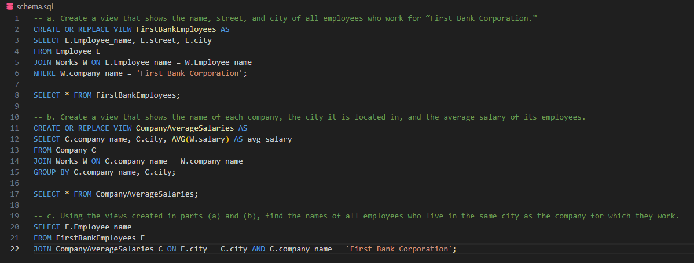

# DSC_E3.19

a. Create a view that shows the name, street, and city of all employees who work for “First Bank Corporation.”

b. Create a view that shows the name of each company, the city it is located in, and the average salary of its employees.

c. Using the views created in parts (a) and (b), find the names of all employees who live in the same city as the company for which they work.

